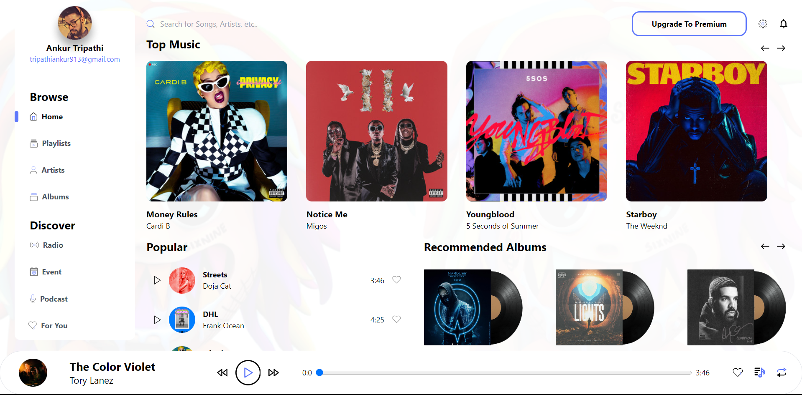

# MUSIC PLAYER UI

Project built using React + Vite and Tailwind CSS for styling.

---

## HOW TO RUN THE PROJECT

- clone the repository
- cd into the folder
- run 'npm install'
- after the installation, run 'npm run dev'
- the project should be runnning on your localhost.

## folder structure

- the SPA mainly uses the App component as its Root.
- All the components required have been created inside 'src/components'
- The 'src/assets' file mainly contains the background, mp3 file for playing music, and some image assets.
- a data folder has been created which contains the json data of the songs and its metadata.

## how to setup json-server

- just create 3 new terminal instances and run the following commands
  - npx json-server --watch data/TopMusic.json --port 8000
  - npx json-server --watch data/Popular.json --port 8001
  - npx json-server --watch data/Recommended.json --port 8002

---

